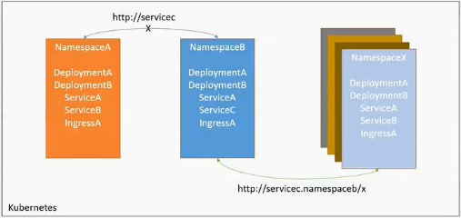
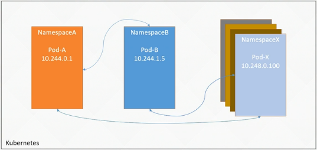

### Kubernetes知识拓展-网络策略

---

#### 1.1 网络策略 Network Policy

提供的功能

+ K8s 命名空间隔离性
+ K8s Pod直接是没有隔离性的


:deciduous_tree: K8s 命名空间隔离性

+ 在 A 命名空间下创建的的资源名称 可以与 B 命名空间下创建的名称相同
+ A 请求 B 的资源，直接 http://svc 是不能访问到 B 的资源，需要 http://svc.namespace/x 就可以访问到其他命名空间的资源，实现跨命名访问
+ K8s的 命名空间隔离性不是强隔离，是一种软隔离， http://svc.namespace/x  就可以跨访问是非常不安全的

  


 :deciduous_tree: K8s Pod直接是没有隔离性的

+ 知道其他命名空间 Pod 的IP，在任一命名空间下其他 Pod 都可以访问（存在安全风险）
+ 如果一个Pod被攻击，在登录上Pod后便可以扫描攻击 K8s 内部
+ 在传统的 物理机虚拟机部署，可以通过 iptables 或者防火墙控制访问策略，但是在通过这些策略K8s达不到这种要求，K8s Pod 非常高的弹性机制（扩容、发布）副本特别多时、IP地址也会发生系列变化；所以出现了 K8s 网络策略

 

 

:deciduous_tree: K8s 网络策略

可以利用 CNI 网络插件，实现网络之间的访问策略，达到目的；

+ Pod 默认非隔离状态，Svc也可以跨命名空间访问；为了防止风险，可以做网络策略

 

1. 拒绝掉跨命名空间访问
2. 同一命名空间的 Pod 只能被统一命名空间访问
3. 只希望前端只能被 ingress Controller 访问，不能被其他 Pod 访问


#### 1.2 NetworkPolicy配置详解

https://kubernetes.io/zh-cn/docs/concepts/services-networking/network-policies/

NetworkPolicy 的示例:

```yaml
apiVersion: networking.k8s.io/v1
kind: NetworkPolicy
metadata:
  name: test-network-policy
  namespace: default
spec:
  podSelector:		# 表示策略对哪些 Pod 生效
    matchLabels:
      role: db
  policyTypes:		# 限制入口和出口
    - Ingress
    - Egress
  ingress:			# 入口
    - from:
        - ipBlock:	# 选择特定的 IP CIDR 范围以用作入站流量来源或出站流量目的地
            cidr: 172.17.0.0/16	# 此网段之内
            except:	
              - 172.17.1.0/24	# 又排除了该网段，剩下的网段都可以
        - namespaceSelector:	# 也可以允许特定的名字空间流量
            matchLabels:
              project: myproject
        - podSelector:			# 也可以允许具有 role: frontend 标签的 Pod	
            matchLabels:
              role: frontend
      ports:					# 只能访问服务的 6379 端口，如果没配置就是可以访问所有端口
        - protocol: TCP
          port: 6379
  egress:
    - to:
        - ipBlock:
            cidr: 10.0.0.0/24
      ports:
        - protocol: TCP
          port: 5978
```

可以非常细粒的限制，通过不同组合配置不同的策略


#### 1.3 NetworkPolicy注意事项

:deciduous_tree: 配置注意事项

from

+ 每个配置块都有一个 ‘’-‘ 说明时切片，在Go语言中称为切片
+ 属于同级别（或）的关系

```yaml
    - from:
        - ipBlock:
            cidr: 172.17.0.0/16
            except:
              - 172.17.1.0/24
        - namespaceSelector:
            matchLabels:
              project: myproject
        - podSelector:
            matchLabels:
              role: frontend
      ports:
        - protocol: TCP
          port: 6379
```

+ 没有“-” ， 是且的关系，允许namespaceSelector 符合标签的并且 podSelector 标签匹配的Pod

```yaml
    - from:
        - ipBlock:
            cidr: 172.17.0.0/16
            except:
              - 172.17.1.0/24
        - namespaceSelector:
            matchLabels:
              project: myproject
          podSelector:
            matchLabels:
              role: frontend
      ports:
        - protocol: TCP
          port: 6379
```

:deciduous_tree: ipBlock 注意事项

在生产环境中，公司的网络是非常复杂的，会涉及到各种的网络转换

+ SNAT
+ DNAT

地址转换后涉及到无法访问

cidr 不推荐设置成 Pod 的 IP地址，Pod重建 飘逸都会改变，推荐设置成集群外部地址，也不能有目的地转换的网络中使用。


#### 1.4 NetworkPolicy 示例1：隔离中间件服务

  

1. 有一个项目，它有自己的数据库 MySQL 和缓存 Redis 中间件，我们只希望这个项目的应用能够访问该中间件
2. 假如有一个项目需要通过ingress 进行对外发布，我们想要除了 ingress 外，其他任何 Namespace 下的 Pod 都不能访问该项目。

​	假设有一个项目需叫 nw-demo , 里面部署了三个微服务，分别是 MySQL、Redis 和 Nginx。现需要对 MySQl、Redis、Nginx进行隔离，分别实现如下效果：

+ MySQl、Redis 只能被该Namespac 下的 Pod访问
+ nginx 可以被ingress-nginx 命名空间下的Pod和该 Namespace下的Pod访问

首先创建该项目所有的 Namespace

```SH
kubectl create ns nw-demo
```

创建 MySQL服务，MySQL以容器启动时，必须设置 root密码，或者设置密码为空，所以要设置一个 MYSQL_ROOT_PASSWORD的变量：

```SH
kubectl create deployment mysql --image=mysql:5.7 -n nw-demo
kubectl set env deploy/mysql MYSQL_ROOT_PASSWORD=mysql -n nw-demo
```

创建Redis

```SH
kubectl create deployment redis --image=redis:6.2 -n nw-demo
```

在没有配置任何网络策略情况下，测试网络的连通性，可以在任意的 Kubernetes 节点上执行 telnet 命令 

```SH
# telnet 172.17.125.11 3306
Trying 172.17.125.11...
Connected to 172.17.125.11.
Escape character is '^]'.
J
5.7.40C U9]:*#^Amysql_native_passwordxterm-256color
!#08S01Got packets out of orderConnection closed by foreign host.
```

> 默认全部都是互通，安全性低


:deciduous_tree: 查看 Pod 的标签

```SH
# kubectl get po -n nw-demo --show-labels
NAME                     READY   STATUS    RESTARTS   AGE     LABELS
mysql-8f446db89-wtgbz    1/1     Running   0          7m48s   app=mysql,pod-template-hash=8f446db89
redis-59d9546cf5-zzr6w   1/1     Running   0          5m37s   app=redis,pod-template-hash=59d9546cf5
```

策略yaml

```yaml
apiVersion: networking.k8s.io/v1
kind: NetworkPolicy
metadata:
  name: mysql-network-policy
  namespace: nw-demo
spec:
  podSelector:
    matchLabels:
      app: mysql
  policyTypes:
    - Ingress
  ingress:
    - from:
        - namespaceSelector:
            matchLabels:
              access-nw-mysql-redis: "true"
      ports:
        - protocol: TCP
          port: 3306

---
apiVersion: networking.k8s.io/v1
kind: NetworkPolicy
metadata:
  name: redis-network-policy
  namespace: nw-demo
spec:
  podSelector:
    matchLabels:
      app: redis
  policyTypes:
    - Ingress
  ingress:
    - from:
        - namespaceSelector:
            matchLabels:
              access-nw-mysql-redis: "true"
      ports:
        - protocol: TCP
          port: 6379
```

查看策略

```SH
# kubectl get networkpolicies -n nw-demo
NAME                   POD-SELECTOR   AGE
mysql-network-policy   app=mysql      29s
redis-network-policy   app=redis      29s
# kubectl get -f mysql-redis-nw.yaml
NAME                   POD-SELECTOR   AGE
mysql-network-policy   app=mysql      52s
redis-network-policy   app=redis      52s
```

telnet 172.17.125.11 3306 不通，在自己的命名空间下

> networkpolicy 生效

:deciduous_tree:为 ns 添加标签

```SH
kubectl label ns nw-demo access-nw-mysql-redis=true
# kubectl get ns nw-demo --show-labels
NAME      STATUS   AGE   LABELS
nw-demo   Active   45m   access-nw-mysql-redis=true,kubernetes.io/metadata.name=nw-demo
```


#### 1.5 NetworkPolicy示例2: 限制服务发布

项目可能 前端网段对外暴露。其他不需要要暴露

 

​	一般情况下，一个项目的服务发布，会将域名的根路径指向前端应用，接口路径指向对应的网关或微服务。假设现在创建一个 Nginx 服务充当 前端页面，配置网络策略只让 Ingress Controller 访问该应用

```sh
kubectl create deployment nginx --image=nginx:1.23 -n nw-demo
kubectl expose deployment -n nw-demo nginx --port=80

# kubectl get svc -n nw-demo
NAME    TYPE        CLUSTER-IP     EXTERNAL-IP   PORT(S)   AGE
nginx   ClusterIP   10.103.92.80   <none>        80/TCP    18s
```

在没有配置网络策略的情况下

```SH
# curl 10.103.92.80:80
<!DOCTYPE html>
<html>
<head>
<title>Welcome to nginx!</title>
<style>
```

其他命名空间下的Podcast 可通过 http://nginx.nw-demo 跨namespace 访问


