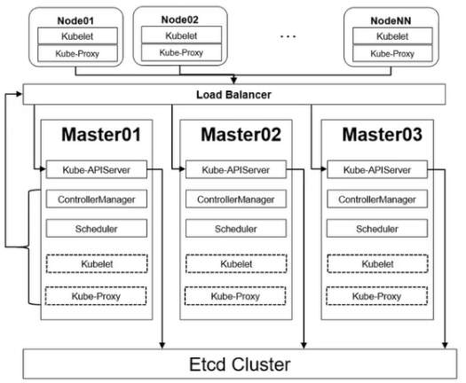
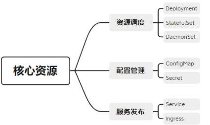
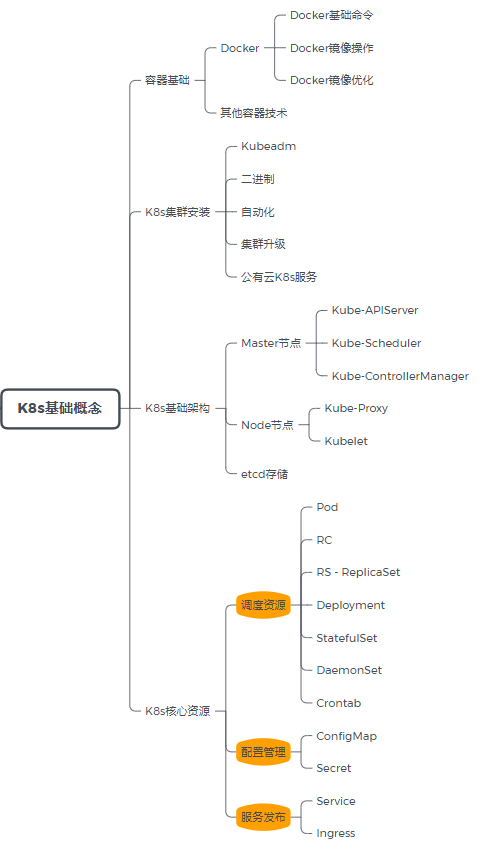
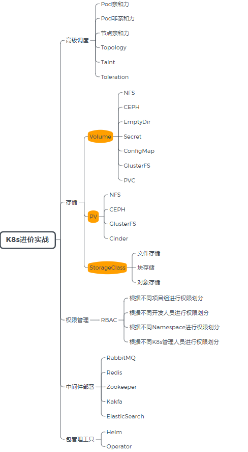
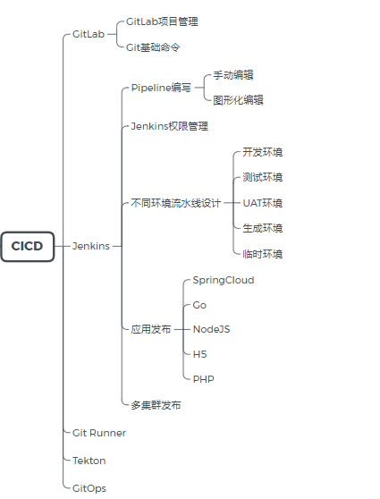
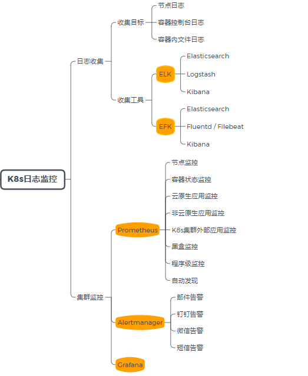

 

这是有关我创建的Kubernetes的学习详细信息。我创建这些文件是为了尝试使用和记录Kubernetes，或者为自己解决问题。

在学习K8s 本不是学习它本身，还有很多K8s之外的需要学习！

---

K8s 为我们带来了什么？

1. 拜托繁琐的工作：一键式创建一整套环境；
2. 降低故障频率：传统架构、很多基础问题如基础环境、依赖版本等问题，处理告警的繁琐工作；K8s使用容器部署；
3. 简化服务配置：简单的额皮质实现非常复杂的功能；
4. 更加强大的服务管理：自动扩缩容、更灵活的服务调度等；

> K8s的学习始终是一个难题，许多人只知其表不知其里

K8s真的很难？

1. 学习方式：踏踏实实型，抽出时间制定计划；
2. K8s到底难在哪？

> Kubernetes 架构

 

> Kubernetes核心资源

  

K8s的核心资源就这几个，为什么学习K8s还是很难？

学习路线：（也称之为劝退图）

1. 基础概念
2. 进阶
3. CICD
4. 日志与监控

 

 

 

 

---

