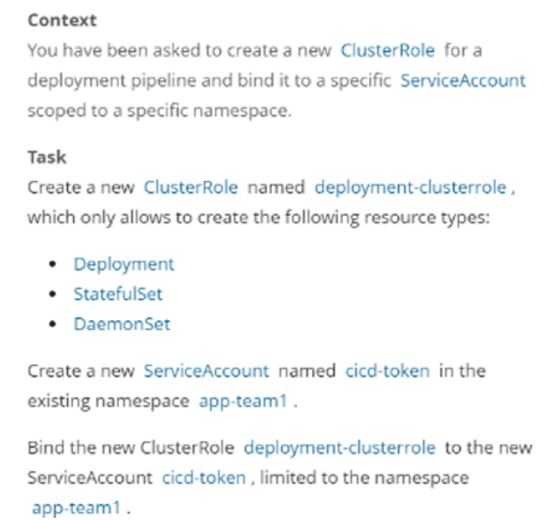

----

CKA认证总结：


##### :deciduous_tree:监控Pod的日志

 

翻译：监控名为 foobar pod 的 logs

+ 提取与错误对应的日志行 unable-to-access-website (无法访问网站)
+ 将他们写入 /opt/KUTR00101/foobar

> 用户可以使用 `kubectl config use-context` 命令快速地在集群之间进行切换

解题：

```MYSQL
# kubectl config  use-context k8s
# kubectl logs foobar | grep "Getting the checksum" >  /opt/KUTR00101/foobar
# cat  /opt/KUTR00101/foobar
10-listen-on-ipv6-by-default.sh: info: Getting the checksum of /etc/nginx/conf.d/default.conf
```


##### :deciduous_tree:监听Pod的度量指标

 

> 首先也是切换集群操作

找出具有 name=cpu-user 的Pod，并且过滤出使用CPU最高的Pod，然后把他的名字写在已经存在的 /opt/KUTR00401/KuTR00401.txt 文件中（注意它没有说指定namespac，所以需要使用-A指定所有namespace）

解题：

> 假设是找app=nginx

```shell
# 先切环境
# kubectl config  use-context k8s
# kubectl top pod -A -l app=nginx | awk '{print $2,$3}' | sort -n
#或者自己比较大小
# kubectl top pod -A -l app=nginx 

# 注意：题目提示这个文件是一直存在的，所以要使用 >> 追加

# echo nginx-6c7985744b-krstf >> /opt/KUTR00401/KuTR00401.txt
# cat /opt/KUTR00401/KuTR00401.txt
nginx-6c7985744b-krstf
```


##### :deciduous_tree:Deploymnet 扩容

 

翻译：扩容loadbalancer 为6个Pod

> 先切环境

```shell
# kubectl config  use-context k8s
# kubectl scale deployment loadbalancer --replicas=6
```


##### :deciduous_tree:检查node节点的健康状态

 

翻译：检查集群中有多少个节点 ready，并且去除包含 NoSchedule污点的节点，之后将数字写道/opt/KUSC00402/kusc00402.txt

解题：

```SHELL
# 切环境
# kubectl config use-context K8s

# kubectl get node | grep -i Ready
# kubectl describe node | grep Taint | grep NoSchedule

# echo "4" > /opt/KUSC00402/kusc00402.txt
```


##### :deciduous_tree:节点维护

 

设置ek8s-node-1为不可用，重新调度节点上所有pod

解题：

```SHELL
# 切环境
kubectl config use-context ek8s
# 解题
# kubectl cordon k8s-node01
# kubectl drain k8s-node01 --ignore-daemonsets --delete-emptydir-data --force
```

+ --ignore-daemonsets：忽略DaemonSet托管pod。
+ --force ： 即使存在未声明控制器的pod，也要继续

##### :deciduous_tree:指定节点部署

  

调度一个Pod ：

+ 名字：nginx-kusc00401
+ image:nginx
+ Node selector: disk=spinning

> 先切环境

```yaml
apiVersion: v1
kind: Pod
metadata:
  labels:
    run: nginx-kusc00401
  name: nginx-kusc00401
spec:
  nodeSelector:
    disk: spinning
  containers:
  - image: nginx
    name: nginx-kusc00401
```

```SHELL
# kubectl create -f pod-ns.yaml
```


调度到某一个节点上，指定了节点名：k8s-node02

> 先切集群

```YAML
apiVersion: v1
kind: Pod
metadata:
  labels:
    run: nginx-kusc00402
  name: nginx-kusc00402
spec:
  nodeName: k8s-node02
  containers:
  - image: nginx
    name: nginx-kusc00402
 
# kubectl create -f pod-ns2.yaml
```


更复杂的：节点亲和力达到相同功能


:deciduous_tree:一个Pod部署多个容器

 

创建一个pod name 为kucc1 这个pod 包含四个容器

+ nginx redis memcached + consul

```YAML
# 切集群

# kubectl run kucc1 --image=nginx -oyaml --dry-run=client > pod-4images.yaml
修改yaml文件
apiVersion: v1
kind: Pod
metadata:
  labels:
    run: kucc1
  name: kucc1
spec:
  containers:
  - image: nginx
    name: nginx
  - image: redis
    name: redis
  - image: memchached
    name: memcached
  - image: consul
    name: consul

# 创建
kubectl create -f pod-4images.yaml
```


##### :deciduous_tree:Service考题分析

 

> 教程 Service

解释：

​		重新配置一个已经存在的deployment front-end，在nginx容器里面添加一个端口配置，名字为http，暴露端口80；

​	创建一个新的Svc 名 front-end-svc 暴露该容器的http端口

​	将新服务配置为也通过NodePort在其上计划的节点上公开各个pod

1. 先切环境

2. kubectl edit deployments.apps fornt-end

```yaml
    spec:
      containers:
      - image: nginx:1.23
        imagePullPolicy: IfNotPresent
        name: nginx
        ports:
        - containerPort: 80
          name: http
          protocol: TCP
        resources: {}
```

3. 暴露一个service

```YAML
# kubectl expose deployment fornt-end --name=front-end-svc --port=80 --target-port=http --type=NodePort
```


##### Ingress

 


> 概述 ingress


创建一个nginx的ingress

+ name：pong
+ 命名空间：ing-internal
+ 代理的 service hi，端口为 5678， 配置路径/hi。

验证：curl -kL ip/hi

1. 先切集群

```YAML
apiVersion: networking.k8s.io/v1
kind: Ingress
metadata:
  name: pong
  namespace: ing-internal
spec:
  rules:
  - http:
      paths:
      - path: /hi
        pathType: Prefix
        backend:
          service:
            name: hi
            port:
              number: 5678
```

```YAML
# kubectl create -f ingress.yaml
```


##### Sidecar

 

中文解释： 

​		添加一个名为 busybox 且镜像为 busybox 的 sidecar 到一个已经存在的名为 legacy-app 的 Pod 上，这个 sidecar 的启动命令为/bin/sh, -c, 'tail -n+1 -f /var/log/legacy-app.log'。 并且这个 sidecar 和原有的镜像挂载一个名为 logs 的 volume，挂载的目录为/var/log/

 解题

1. 切环境
2. 导出legacy-app的Pod，做一个精简

```YAML
apiVersion: v1
kind: Pod
metadata:
  name: legacy-app
spec:
  containers:
  - name: legacy-app
    image: busybox
    args:
    - /bin/sh
    - -c
    - >
      i=0;
      while true;
      do
        echo "$i: $(date)" >> /var/log/legacy-app.log;
        i=$((i+1));
        sleep 1;
      done     
```

为这个Pod文件添加内容：

```yaml
    volumeMounts:
    - name: logs
      mountPath: /var/log
  - name: busybox
    image: busybox
    args: [/bin/sh, -c, 'tail -n+1 -F /var/log/legacy-app.log']
    volumeMounts:
    - name: logs
      mountPath: /var/log
  volumes:
  - name: logs
    emptyDir: {}
```

> 关键自 logging
>
> https://kubernetes.io/docs/concepts/cluster-administration/logging/


##### RBAC考题

 

中文解释： 

​		创建一个名为 deployment-clusterrole 的 clusterrole，该 clusterrole 只允许创建 Deployment、 Daemonset、Statefulset 的 create 操作 

​		在名字为 app-team1 的 namespace 下创建一个名为 cicd-token 的 serviceAccount

​		并且将上一 步创建 clusterrole 的权限绑定到该 serviceAccount

解题：

1. 切环境

https://kubernetes.io/zh-cn/docs/reference/access-authn-authz/rbac/

```YAML
apiVersion: rbac.authorization.k8s.io/v1
kind: ClusterRole
metadata:
  name: deployment-clusterrole
rules:
- apiGroups: ["apps"]
  resources: ["deployments","daemonsets","statefulsets"]
  verbs: ["create"]
```

创建sa

```YAML
# kubectl create sa cicd-token -n app-team1
```

绑定：

```SHELL
# kubectl create rolebinding deployment-rolebinding --clusterrole=deployment-clusterrole --serviceaccount=app-team1:cicd-token --namespace=app-team1
```


##### NetworkPolicy

 

> 先切集群

```SHELL
# kubectl config use-context hk8s
```

中文解释：

创建一个新的 NetworkPolicy 名为 allow-port-from-namespace 

这个 NetworkPolicy 允许 internal 命名空间下的 Pod 访问该命名空间下的 9000 端口

确保新的网络策略：

+ 不允许访问未在端口9000上侦听的Pod
+ 不允许访问不在namespaceinternal中的Pod

解题：

```yaml
apiVersion: networking.k8s.io/v1
kind: NetworkPolicy
metadata:
  name: allow-port-from-namespace
  namespace: internal
spec:
  podSelector: {}
  policyTypes:
    - Ingress
  ingress:
    - from:
      ports:
        - protocol: TCP
          port: 9000
```


更新1：

在现有的 namespace my-app 中创建一个名为 allow-port-from-namespace 的 NetworkPolicy 确保这个 NetworkPolicy 允许 namespace my-app 中的 pods 可以连接到 namespace big-corp 中 的 8080。 

+ 并且不允许不是 my-app 命令空间的下的 Pod 访问
+ 不允许访问没有监听 8080 端口的 Pod。

```yaml
apiVersion: networking.k8s.io/v1
kind: NetworkPolicy
metadata:
  name: allow-port-from-namespace
  namespace: my-app
spec:
  podSelector: {}
  policyTypes:
    - Ingress
    - Egress
  ingress:
    - from:
      ports:
        - protocol: TCP
          port: 8080
  egress:
    - to:
        - namespaceSelector:
            matchLabels:
              kubernetes.io/metadata.name: big-corp
      ports:
        - protocol: TCP
          port: 5978
```


更新2：

 

第一步：切集群

```YAML
kubectl config use-context hk8s
```

第二部创建yaml文件

```YAML
apiVersion: networking.k8s.io/v1
kind: NetworkPolicy
metadata:
  name: allow-port-from-namespace
  namespace: big-corp
spec:
  policyTypes:
    - Ingress
    - Egress
  ingress:
    - from:
        - namespaceSelector:
            matchLabels:
              kubernetes.io/metadata.name: internal
      ports:
        - protocol: TCP
          port: 9200
```

> kubectl get ns --show-labels 查看 labels 配置

kubectl create -f 创建


##### PersistentVolume

 

中文解释：

创建一个pv叫 app-config,大小为2G、访问权限ReadWriteMany，类型 hostpath、路径/srv/app-config

第一步：切集群

第二步：

```yaml
apiVersion: v1
kind: PersistentVolume
metadata:
  name: app-config
spec:
  storageClassName: manual
  capacity:
    storage: 2Gi
  accessModes:
    - ReadWriteMany
  hostPath:
    path: "/srv/app-config"
```


##### CSI & PersistentVolumeClaim 

 

中文：

创建一个新的 pvc：

+ 名：pv-volume
+ class：csi-hostpath
+ 容量：10Mi

创建一个新的Pod挂载PVC：

+ name：web-server
+ image：nginx
+ Mount path：/usr/share/nginx/html

配置性的Pod的卷权限：ReadWriteOnce

使用kubectl edit或kubectl patch将Persistentvolumeclaim扩展到70MI的容量，并记录更改;

---

第一步：切集群

第二步：创建文件

```YAML
apiVersion: v1
kind: PersistentVolumeClaim
metadata:
  name: pv-volume
spec:
  storageClassName: csi-hostpath
  accessModes:
    - ReadWriteOnce
  resources:
    requests:
      storage: 10Mi
```

创建Pod

```
apiVersion: v1
kind: Pod
metadata:
  name: web-server
spec:
  volumes:
    - name: pv-volume
      persistentVolumeClaim:
        claimName: pv-volume
  containers:
    - name: nginx
      image: nginx
      volumeMounts:
        - mountPath: "/usr/share/nginx/html"
          name: pv-volume
```

修改：

kubcetl edit pvc pv-volume


##### ETCD

 

解释：

任务：

​		首先创建一个快照针对 etcd 实例 https://127.0.0.1:2379；保存到/srv/data/etcd-snapshot.db，如果卡住就使用 ctrl c，然后重试

​		然后恢复一个已经存在的快照：/var/lib/backup/etcd-snapshot-previous.db

执行etcdctl连接到服务器，证书存放在：

+ ca 证书：/opt/KUIN00601/ca.crt
+ 客户端证书：/opt/KUIN00601/etcd-client.crt
+ 客户端密钥：/opt/KUIN00601/etcd-client.key

> 本地不需要切集群，可能会有需要ssh切

```shell
export ETCDCTL_API=3

# 备份
etcdctl --endpoints="https://127.0.0.1:2379" \
 --cacert="/etc/kubernetes/pki/etcd/ca.crt" \
 --cert="/etc/kubernetes/pki/etcd/server.crt" \
 --key="/etc/kubernetes/pki/etcd/server.key" \
  snapshot save /srv/data/etcd-snapshot.db

#还原
mkdir /opt/backup -p
cd /etc/kubernetes/manifests/;mv kube-* /opt/backup/
export ETCDCTL_APP=3
etcdctl --endpoints="https://127.0.0.1:2379" --cacert="/etc/kubernetes/pki/etcd/ca.crt" --cert="/etc/kubernetes/pki/etcd/server.crt" --key="/etc/kubernetes/pki/etcd/server.key" snapshot restore /srv/data/etcd-snapshot.db --data-dir=/var/lib/etcd-restore

# 将 volume 配置的 path: /var/lib/etcd 改成/var/lib/etcd-restore
 volumes:
 - hostPath:
 path: /etc/kubernetes/pki/etcd
 type: DirectoryOrCreate
 name: etcd-certs
 - hostPath:
 path: /var/lib/etcd-restore
 
 mv /opt/backup/* /etc/kubernetes/manifests
```


注意：不一定是/etc/kubernetes/manifests/

```YAML
 find /opt -name 'kube-apiserver*'
 方法2：
 systemctl status kubelet	# Drop-In
 
```

注意2：回复不成功，加--sip -h查看下


##### K8s升级

 

将master节点上的所有Kubernete控制平面和节点组件仅升级到版本1.19.0。

还需要在master上升级kubelet和kubectl

警告：升级前

+ 设置为不可用状态
+ 升级完成后设置为可调度状态

解题：

> 切集群

```
1.设置状态、驱逐Pod
kubectl cordon k8s-master02
kubectl drain k8s-master02 --delete-emptydir-data --ignore-daemonsets --force

2.升级
apt update
apt-cache policy kubeadm | grep 1.19.0
apt-get install kubeadm=1.19.0-00

3.验证
kubeadm upgrade plan
```

升级 Master 节点

```
kubeadm upgrade apply v1.19.0 --etcd-upgrade=false
```

升级 kubectl 和 kubelet

```
apt-get install -y kubelet=1.19.0-00 kubectl=1.19.0-00
systemctl daemon-reload
systemctl restart kubelet
解除：
Kubectl uncordon k8s-master
```


升级到1.21.1

```
 kubectl cordon k8s-master
 kubectl drain k8s-master --delete-emptydir-data --ignore-daemonsets --force
 apt update
 apt-cache policy kubeadm | grep 1.21.1
 apt-get install kubeadm=1.21.1-00
 kubeadm upgrade plan
# 开始升级 Master 节点
kubeadm upgrade apply v1.21.1 --etcd-upgrade=false -f
# 升级 kubectl 和 kubelet
apt-get install -y kubelet=1.21.1-00 kubectl=1.21.1-00
systemctl daemon-reload
systemctl restart kubelet
kubectl uncordon k8s-master
```

RB9H4PKD

##### 集群故障排除-Kubelet

 

一个名为 wk8s-node-0 的节点状态为 NotReady，让其他恢复至正常状态，并确认所有的更 改开机自动完成

解题：

> 考试一定要ssh

```
1.SSH登录该节点
ssh wk8s-node-0
sudo -i
systemctl status kubelet
systemctl start kubelet
systemctl enable kubelet
```


##### 集群故障排除-master节点故障

> 不会考

```
kubectl get node # error：链接不上apiserver
---
netstat -lntp | grep 6443
systemctl status kube-apiserver
如果没有就是使用kubeadm启动的

```

[创建静态 Pod | Kubernetes](https://kubernetes.io/zh-cn/docs/tasks/configure-pod-container/static-pod/)


